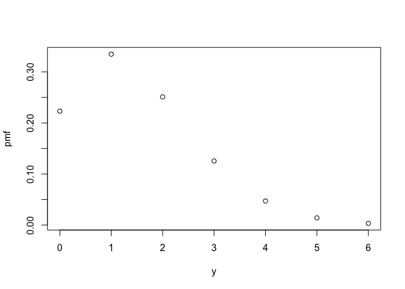
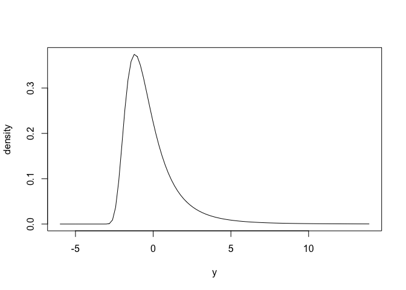
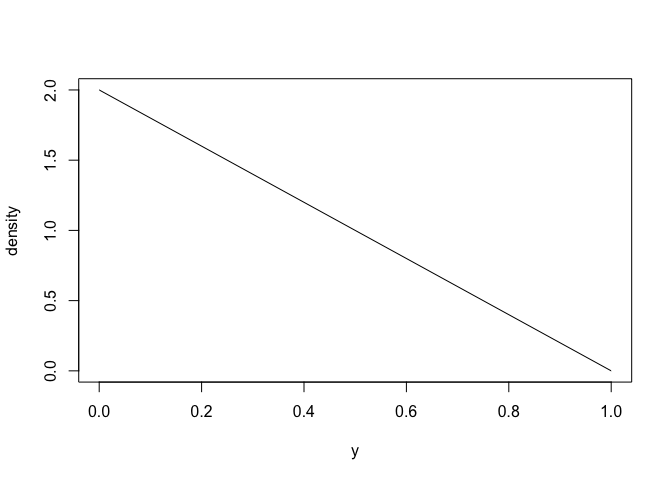

# distionary

With `distionary`, you can:

1.  Specify a probability distribution
    ([built-in](https://distionary.probaverse.com/articles/specify-built-in.html)
    or [your
    own](https://distionary.probaverse.com/articles/specify-user-defined.html)),
    and
2.  [Evaluate](https://distionary.probaverse.com/articles/evaluate.html)
    the probability distribution.

The main purpose of `distionary` is to implement a distribution object,
and to make distribution calculations available even if they are not
specified in the distribution’s definition. `distionary` provides the
building blocks of the wider [`probaverse`
ecosystem](https://probaverse.com) for making representative statistical
models.

The name “distionary” is a portmanteau of “distribution” and
“dictionary”. While a dictionary lists and defines words, `distionary`
defines distributions and makes a list of common distribution families
available. The built-in distributions act as building blocks for the
wider probaverse.

## Statement of Need

When building statistical models, distributions should accurately
reflect your data, but out-of-the-box options like the Normal or Poisson
distributions often fall short. Achieving realistic probability
distributions demands a versatile workbench where distributions can be
manipulated, and data can inform their features. This is the goal of the
`probaverse` ecosystem, with `distionary` providing the foundational
building blocks.

`distionary` provides the fundamental `probaverse` infrastructure for
defining probability distribution objects. It allows for the evaluation
of distribution properties, even if they aren’t explicitly specified,
offering standalone utility for users needing to define a distribution
in various forms and evaluate it comprehensively.

## Target Audience

Lots of people work with probability distributions. Lots of people
*don’t* work with probability distributions but should, because they
don’t see the value or because distributions are too clumsy to work with
under existing infrastructure. And, there are lots of people learning
about probability distributions that would have an easier time if they
get to “feel” distributions and their multifaceted nature. `distionary`
is for all of these people.

`distionary` – and the `probaverse` more widely – is designed for data
scientists, statisticians, and researchers who require the flexibility
to develop custom statistical models. It caters to those in finance,
insurance, environmental science, and engineering, where nuanced
distribution modeling is crucial. Whether building complex stochastic
models or performing detailed risk assessments, `distionary` equips
users with the tools needed to explore and manipulate probability
distributions effectively.

`distionary` makes reference to common terms regarding probability
distributions. If you’re uneasy with these terms and concepts, most
intro books in probability will be a good resource to learn from. As
`distionary` develops, more documentation will be made available so that
it’s more self-contained.

## Installation

To install `distionary`, run the following code in R:

``` r

install.packages("distionary")
```

## Example: Built-in Distributions

``` r

library(distionary)
```

**Specify** a distribution like a Poisson distribution and a Generalised
Extreme Value (GEV) distribution using the `dst_*()` family of
functions.

``` r

# Create a Poisson distribution
poisson <- dst_pois(1.5)
# Inspect
poisson
#> Poisson distribution (discrete) 
#> --Parameters--
#> lambda 
#>    1.5
```

``` r

# Create a GEV distribution
gev <- dst_gev(-1, 1, 0.2)
# Inspect
gev
#> Generalised Extreme Value distribution (continuous) 
#> --Parameters--
#> location    scale    shape 
#>     -1.0      1.0      0.2
```

Here is what the distributions look like, via their probability mass
(PMF) and density functions.

``` r

plot(poisson)
```



``` r

plot(gev)
```



**Evaluate** various *distributional properties* such as mean, skewness,
and range of valid values.

``` r

mean(gev)
#> [1] -0.1788514
skewness(poisson)
#> [1] 0.8164966
range(gev)
#> [1]  -6 Inf
```

Properties that completely define the distribution are called
*distributional representations*, and can be accessed by the `eval_*()`
functions. such as the PMF or quantiles. The `eval_*()` functions simply
evaluate the representation, whereas the `enframe_*()` functions place
the output alongside the input in a data frame or tibble.

``` r

eval_pmf(poisson, at = 0:4)
#> [1] 0.22313016 0.33469524 0.25102143 0.12551072 0.04706652
enframe_quantile(gev, at = c(0.2, 0.5, 0.9))
#> # A tibble: 3 × 2
#>    .arg quantile
#>   <dbl>    <dbl>
#> 1   0.2   -1.45 
#> 2   0.5   -0.620
#> 3   0.9    1.84
```

## Example: Custom Distributions

You can create a custom distribution using
[`distribution()`](https://docs.ropensci.org/distionary/reference/distribution.md).
The innovative aspect of `distionary` is its ability to automatically
compute properties from the specified representations. By providing just
one or two representations (such as CDF and density), `distionary` can
derive other properties as needed.

``` r

# Make a distribution by specifying only density and CDF
linear <- distribution(
  density = function(x) {
    d <- 2 * (1 - x)
    d[x < 0 | x > 1] <- 0
    d
  },
  cdf = function(x) {
    p <- 2 * x * (1 - x / 2)
    p[x < 0] <- 0
    p[x > 1] <- 1
    p
  },
  .vtype = "continuous",
  .name = "My Linear"
)
# Inspect
linear
#> My Linear distribution (continuous) 
#> --Parameters--
#> NULL
```

Here is what it looks like (density function).

``` r

plot(linear)
```



Even though only the density and CDF were specified, other properties
can be evaluated, like its mean and quantiles:

``` r

mean(linear)
#> [1] 0.3333333
enframe_quantile(linear, at = c(0.2, 0.5, 0.9))
#> # A tibble: 3 × 2
#>    .arg quantile
#>   <dbl>    <dbl>
#> 1   0.2    0.106
#> 2   0.5    0.293
#> 3   0.9    0.684
```

## `distionary` in the Context of Other Packages

The R ecosystem offers several packages for working with probability
distributions, each with unique strengths:

- **`stats` Package**: Provides fundamental functions for standard
  distributions but lacks a unified object-oriented approach for complex
  manipulations.

- **`distr` Package**: Introduces an object-oriented framework for
  distribution objects using S4, offering flexible manipulation, though
  it can be complex to extend and use.

- **`distributions3` Package**: Utilizes S3 classes for a
  straightforward interface focused on simplicity, suitable for basic
  tasks but may not meet advanced application needs.

- **`distributional` Package**: Extends `distributions3` to support
  vectorized operations, aiding statistical modelling but lacking
  extensive tools for custom distribution creation.

In this landscape, `distionary` addresses the need for a cohesive and
flexible API that can seamlessly integrate the strengths of these
packages. It provides a unified framework for defining, manipulating,
and evaluating probability distributions. Because `distionary` only
needs some distribution properties to be specified, it offers a level of
flexibility central to the `probaverse` ecosystem.

## Acknowledgements

The creation of `distionary` would not have been possible without the
support of BGC Engineering Inc., the R Consortium, the Politecnico di
Milano, the European Space Agency, The University of British Columbia,
and the Natural Science and Engineering Research Council of Canada
(NSERC). The authors would also like to thank the reviewers from
ROpenSci for their insightful feedback, which greatly contributed to
enhancing the quality of this R package.

## Citation

To cite package `distionary` in publications use:

Coia V (2025). *distionary: Create and Evaluate Probability
Distributions*. R package version 0.1.0,
<https://github.com/probaverse/distionary>,
<https://distionary.probaverse.com/>.

## Code of Conduct

Please note that the distionary project is released with a [Code of
Conduct](https://distionary.probaverse.com/CODE_OF_CONDUCT.html). By
contributing to this project, you agree to abide by its terms.
